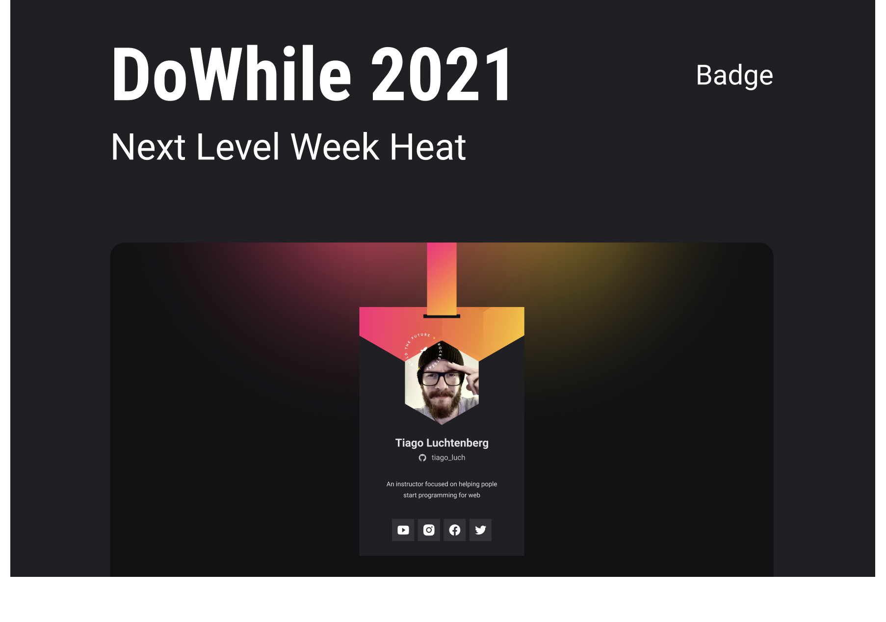

<h1 align="center">
  Badge Virtual DoWhile
</h1>

  <a href="#-Technologies">Technologies</a>&nbsp;&nbsp;&nbsp;|&nbsp;&nbsp;&nbsp;
  <a href="#-Project">Project</a>&nbsp;&nbsp;&nbsp;|&nbsp;&nbsp;&nbsp;
  <a href="#-layout">Layout</a>&nbsp;&nbsp;&nbsp;|&nbsp;&nbsp;&nbsp;

 

  

## 🚀 Technologies

This project was developed with the following technologies:

- HTML
- CSS
- JavaScript

## 💻 Project

The DoWhile Virtual Badge is a static application with the goal of showing the user information brought from the GitHub API and inserting it in a layout with the face of the DoWhile 2021 event

## 🔖 Layout

You can view the project layout through [this link](<https://www.figma.com/file/9Z2vxc8VTRuZpYjFalCMAl/Badge-Do-While2021-(Copy)?node-id=0%3A1>).
---

Feito com ♥ by Felipe Costa